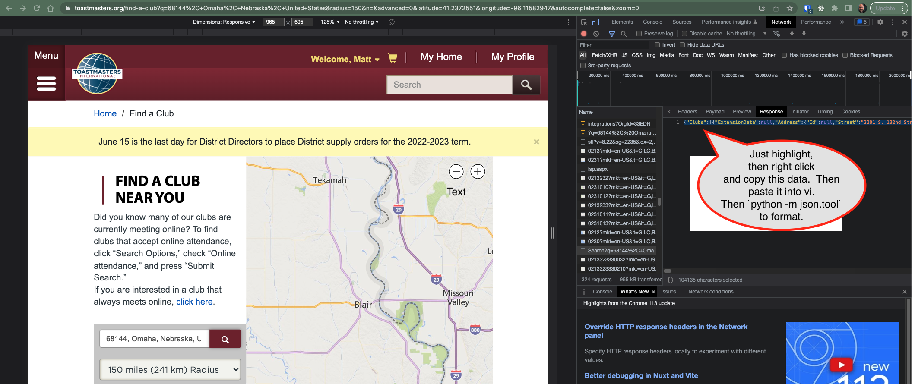

# Getting to know people in d24tm.org toastmasters


https://d24tm.org/2023-2023_District_Officers.html has a bit of an org chart and a list of clubs for each of the Division Directors and Area Directors.  
But does not have much data or links about each of the clubs.  Looking at the [find a club feature](https://www.toastmasters.org/find-a-club?q=68144%2C+Omaha%2C+Nebraska%2C+United+States&radius=25&n=&advanced=0&latitude=41.2373&longitude=-96.1158&autocomplete=true&zoom=0) of Toastmasters.org better data is available.   So, I'll try to start collecting it.

# Some jq scripts

Try this example: 

```
./jq_club_names_and_location.sh*
```

# Getting the data with Chrome




